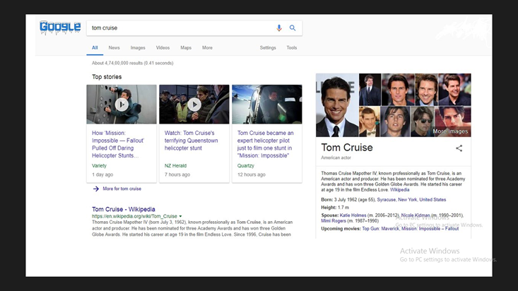
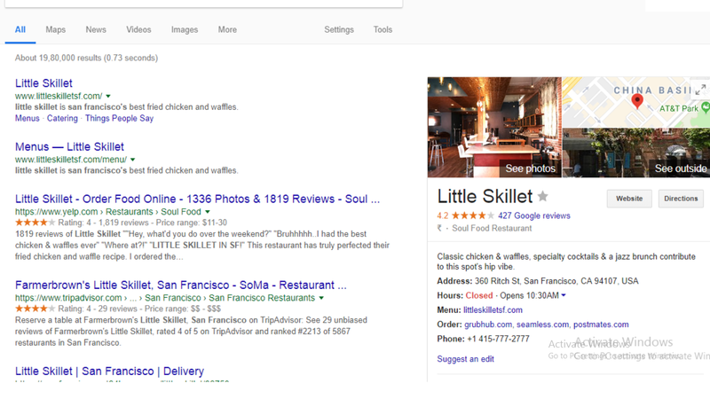
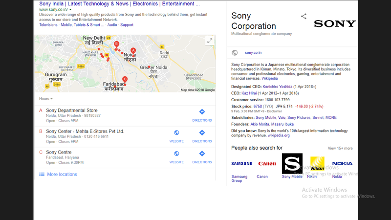
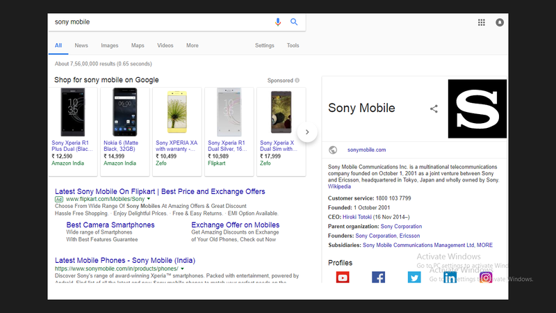

&emsp;谷歌知识图谱是一个革命性的工具，它可以使用户发现自己的业务，在不需要在你的页面进行任何点击的情况下与你互动。有趣吗？让我们一起来探索。  
&emsp;如果你正在寻找如何在网络上建立品牌知名度的方法；想要用户在进行搜索的时候，提供您企业的相关信息，谷歌知识图谱可以帮助你。  
&emsp;在2012年的时候，谷歌宣布了自己的知识图谱。它是一个工具，它整理所有人，位置以及物品的信息，来创建相互关联的搜索结果，为用户展示有用的回答，而非链接。这可以帮助谷歌实现它的使命：组织世界的信息，使用户可以在任何时间、任何地点进行上网体验。

&emsp;谷歌知识图谱关注用户，为他们提供快速而直接的信息，在形式上类似于一个简易小卡片。这不仅仅有利于用于，也能成为一个伟大的商业工具。

&emsp;作为一个品牌，当你为业务而优化知识图谱的时候，谷歌可以更了解你网站上的内容。基于用户搜索的相关性，它可以展示你的品牌信息，帮你提交更多流量，增加你的排名。

### 谷歌知识图谱如何工作？

&emsp;谷歌知识图谱以两种形式展示信息—在搜索结果页面右侧出现的知识图谱卡框中和在搜索页面最上方的旋转方格中。当用户在谷歌中搜索的时候，它们可以为用户提供简洁、特别、正确的信息。

&emsp;谷歌有三种方式确定了你的品牌是否应该包含在知识图谱中。它们是：

- 用户行为—谷歌知道并且理解用户正在搜索什么，它们正在点击什么以及它们在点击一个网页之后，停留了多久。这是由于图谱通过算法连接了所有这些数据，得出的结果，包含了你的品牌。所以，正通过用户的查询和知识图谱将信息展示了出来。
- 语义搜索—为了产生高相关性的搜索结果，知识图谱结合了语义搜索。它包含了搜索内容，同义词、搜索者所在的位置以及其他相关信息。
- 实体索引—谷歌尝试通过实体识别的方式，将所有相关的实体编目，并且消除歧义以生成每个实体的真实信息。

&emsp;我们来看以下几个例子来介绍当用户在谷歌搜索之后，知识图谱是如何工作的。

&emsp;案例1：在谷歌搜索中输入‘著名好莱坞演员’，它将以旋转方格的方式展示所有好莱坞著名演员之中的几张图片。相似地输入‘Tom Cruise’，它将展示一系列卡框(也被成为知识图谱卡片)关于这个名人的图片在搜索结果的右边。

&emsp;让我们来看看另一个例子，关于一家当地企业。

&emsp;案例2：尝试搜索一个餐厅— 在谷歌搜索框中输入‘Little Skillet’。你可以在右手边看见一个卡框，卡框里面都是有关这个餐厅的所有信息，包括评论、地址、联系电话以及导航。

### 谷歌知识图谱如何帮助你的品牌？

&emsp;你知道对于一个品牌来说，在谷歌搜索引擎中提升排名以增加流量，这是非常重要的。但是为了更进一步提高排名，你需要专注于使用谷歌知识图谱。尽管这不是一件非常容易的事情，并且需要花费更多的时间，但却值得。

&emsp;使用知识图谱可以帮助给搜索者展示关于你品牌的有用消息，例如：地址、营业时间、导航、联系方式等。它可以通过评价和评分来体现你的信誉。如果对你的企业有一个好的评价，用户更愿意来你的网站。

&emsp;谷歌知识图谱是一个工具，它可以帮助节省很多时间，不用去浪费精力去点击每一个链接来寻找想要的信息。

&emsp;有三个关键对于使用谷歌知识图谱：

&emsp;使用知识图谱有一些你从来没有意识到的好处。所以，让我们一起了解更多有关于知识图谱的好处:

1. 基本到相关信息的展示—当你的品牌使用知识图谱，它最初会展示一些基本信息。随着知识图谱的逐渐演进，它将会逐渐改善响应并开始展示一些更多的相关信息和基于用户搜索优化后的网页。

&emsp;   例如：在搜索框中输入'Sony'(索尼)，它将展示一个卡框，里面是关于索尼公司的所有数据。

&emsp;  现在搜索‘sony mobile’（索尼手机），你将会发现一个卡框，它提供你所有有关于索尼手机的信息-索尼的电信机构。

2. 运用大量经验为客户提供服务—谷歌知识图谱是一个引擎，它可以加强右边的面板(知识图谱卡片)。当用户搜索一些关于地点、品牌、音乐或者任务的时候，它提供了关于这些主题足够的数据，包括图像、相关信息和相关搜索。这意味着，在一个单一的卡框中，你可以获得你正在查找的信息，这能够给用于一个良好的搜索体验。
3. 提升网站流量—知识图谱是一个很好的工具，在你的用户尚未浏览你的网站之前，与你的品牌建立联系。当网站产生了相关的属性(例如评论)的时候，用户可以迅速了解到你的品牌是如何被评分的。如果都是网站都是正面的评论，它将会促使那些搜索的人访问你的网站。