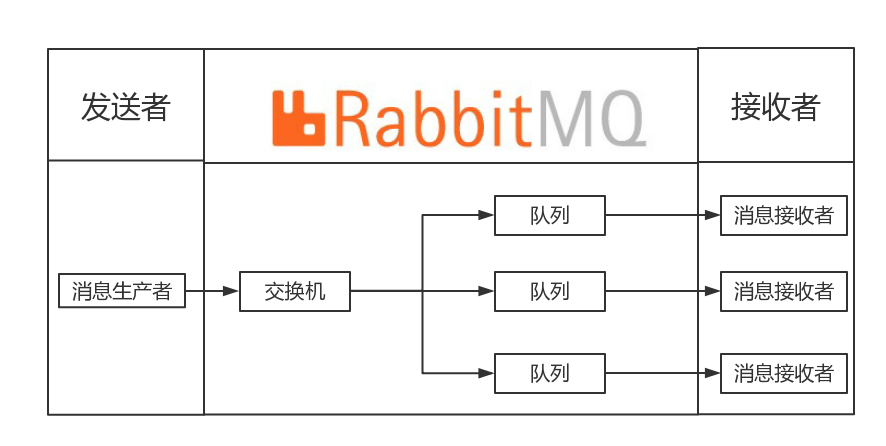
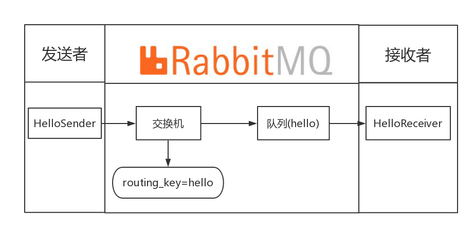
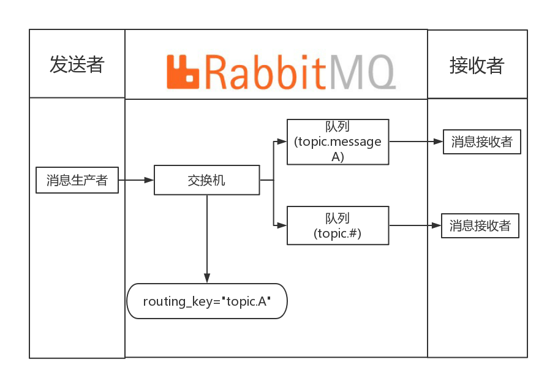
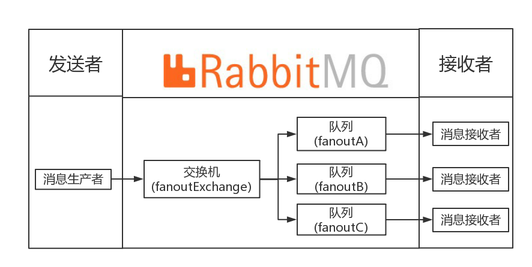

## 简单介绍
微服务中消息队列也是最终的一块，主要解决在微服务中应用，异步消息等问题。目前使用较多的消息队列有：kafka、rabbitmq、zeromq以及activeMQ等。本章重点介绍的是rabbitmq。

## 前提准备
本例的rabbitmq的版本为rabbitmq:3.6.6-management，采用docker安装的方式。  
在安装docker的电脑上输入以下命令,浏览器中输入`localhost:15672`或者linux中运行`curl localhost:15672`即可  
```
docker run -d --name=rabbitmq -p 5672:5672 -p 15672:15672 -e RABBITMQ_DEFAULT_USER=admin -e RABBITMQ_DEFAULT_PASS=admin rabbitmq:3.6.6-management
```
```
docker run 表示docker启动容器。
--name表示容器名称。
-p 表示端口，rabbitmq的5672为AMQP协议端口，15672为管理界面端口。
-e 为对应参数，本例中默认的用户名密码为admin/admin
rabbitmq:3.6.6-management 表示镜像名称，本例默认为docker官方镜像
```

## 使用

消息队列一般有三个核心组件：消息发送者，队列，消息接收者。RabbitMQ在此基础上添加了交换器 (Exchange)的概念。所以，在Rabbitmq中，消息发送者将消息发送至交换机中，再由交换机根据调度策略发送给队列，最后，由消息接收者接收消息。  
具体如下图所示:  


一般Rabbitmq有三种常用模式:  
1.Direct Exchange  
2.Topic Exchange  
3.Fanout Exchange  

### Direct Exchange
Direct Exchange是RabbitMQ默认的交换形式，如下图所示，exchange直接根据routing_key（路由键）去将消息发送至对应的队列中。 


直接启动项目并在命令行输入'curl localhost:8080/hello',控制台输入以下内容
```
Sender : hello Sun Dec 17 16:16:47 CST 2017
Receiver  : hello Sun Dec 17 16:16:47 CST 2017
```

具体实现如下:  
配置队列,在项目中配置了一个hello的队列。
```
@Configuration
public class RabbitConfig {
    @Bean
    public Queue Queue() {
        return new Queue("hello");
    }
}
```
配置消息发送者,exchange会根据convertAndSend的第一个参数为路由键（下文为hello）寻找hello的队列。
```
@Component
public class HelloSender {
    @Autowired
    private AmqpTemplate rabbitTemplate;
    public void send() {
        String context = "hello " + new Date();
        System.out.println("Sender : " + context);
        this.rabbitTemplate.convertAndSend("hello", context);
    }
}
```
配置消息发送者,@RabbitListener中为监听的队列名称。
```
@Component
@RabbitListener(queues = "hello")
public class HelloReceiver {
    @RabbitHandler
    public void process(String hello) {
        System.out.println("Receiver  : " + hello);
    }
}
```
配置controller，下面是触发sender的controller。
```
@RestController
public class HelloController {
    @Autowired
    private HelloSender helloSender;
    /**
     * 采用rabbitmq的direct exchange模式
     * @throws Exception
     */
    @GetMapping("/hello")
    public void hello() throws Exception {
        helloSender.send();
    }
}
```
### Topic Exchange
Topic Exchange是RabbitMQ中最灵活的交换形式，它转发消息主要依靠通配符。 比如：  
1.路由键必须是一串字符，用句号（.） 隔开，比如说 topic.messageA  
2.路由模式中的星号(*)，表示匹配路由键指定位置的一个单词，比如说：topic.message.*，匹配路由键逻辑是：第一个单词是 topic，第二个单词是 message，第三个可以任意字符串。  
3.路由模式中的井号(#)，表示相当于一个或者多个单词，例如一个匹配模式是topic.message.#，所有已topic.message开头的路由键都可以匹配上，例如：topic.message.A、topic.messageA或topic.message.B


直接启动项目并在命令行输入'curl localhost:8080/topic1',控制台输入以下内容。（topic1的路由是topic.1，因此只有topic.#才能匹配上。）
```
Sender : hi, i am message 1
Topic ReceiverB : hi, i am message 1
```
直接启动项目并在命令行输入'curl localhost:8080/topic2',控制台输入以下内容。（topic2的路由是topic.messageA，因此topic.messageA与topic.#都能匹配上。）
```
Sender : hi, i am messages 2
Topic ReceiverB : hi, i am messages 2
Topic ReceiverA : hi, i am messages 2
```

具体实现如下:  
配置队列,在项目中配置了两个队列topic.messageA、topic.messageB。topic.messageA只绑定了topic.messageA，也就是只有路由topic.messageA才可以进入该队列中。topic.messageB绑定了topic.#，即只要topic开头的队列就可以进入该队列中。
```
@Configuration
public class TopicRabbitConfig {
    final static String message = "topic.messageA";
    final static String messages = "topic.messageB";
    //创建队列A
    @Bean
    public Queue messageA() {
        return new Queue(message);
    }
    //创建队列B
    @Bean
    public Queue messageB() {
        return new Queue(messages);
    }
    //创建交换器
    @Bean
    TopicExchange exchange() {
        return new TopicExchange("topicExchange");
    }
    //将队列A绑定至topic.messageA的路由键中
    @Bean
    Binding bindingExchangeMessage(Queue messageA, TopicExchange exchange) {
        return BindingBuilder.bind(messageA).to(exchange).with("topic.messageA");
    }
    //将队列A绑定至topic.#的路由键中，*表示一个词,#表示零个或多个词
    @Bean
    Binding bindingExchangeMessages(Queue messageB, TopicExchange exchange) {
        return BindingBuilder.bind(messageB).to(exchange).with("topic.#");
    }
}
```
配置消息发送者,exchange会根据convertAndSend的第一个参数为路由键（下文为hello）寻找hello的队列。
```
@Component
public class TopicSender {
    @Autowired
    private AmqpTemplate rabbitTemplate;
    public void send1() {
        String context = "hi, i am message 1";
        System.out.println("Sender : " + context);
        this.rabbitTemplate.convertAndSend("topicExchange", "topic.message", context);
    }
    public void send2() {
        String context = "hi, i am messages 2";
        System.out.println("Sender : " + context);
        this.rabbitTemplate.convertAndSend("topicExchange", "topic.messageA", context);
    }
}
```
配置消息发送者,@RabbitListener中为监听的队列名称,此处同direct exchange的配置。
```
@Component
@RabbitListener(queues = "topic.messageA")
public class TopicReceiverA {
    @RabbitHandler
    public void process(String message) {
        System.out.println("Topic ReceiverA : " + message);
    }dns-pod.jpeg
}

```
配置controller，下面是触发sender的controller。
```
@RestController
public class HelloController {
    @Autowired
    private HelloSender helloSender;
    /**
     * 采用rabbitmq的topic exchange模式
     * @throws Exception
     */
     @GetMapping("/topic1")
     public void topic1() throws Exception {
        sender.send1();
     }
     /**
      * 采用rabbitmq的topic exchange模式
      * @throws Exception
      */
     @GetMapping("/topic2")
     public void topic2() throws Exception {
        sender.send2();
     }
}
```

### fanout Exchange
Fanout Exchange会将消息转发到所有的消息队列中，只要将队列绑定到fanout中。
下图中，消息生产者将消息发送给交换机（fanoutExchange）上，fanoutA、fanoutB、fanoutC将自己的队列绑定至fanoutExchange上，一旦消息发出，三个队列都会收到消息:


直接启动项目并在命令行输入'curl localhost:8080/fanout',控制台输入以下内容
```
Sender : hi, fanout msg 
fanout Receiver A  : hi, fanout msg 
fanout Receiver B  : hi, fanout msg 
fanout Receiver C  : hi, fanout msg 
```

具体实现如下:  
配置队列,在项目中配置了三个队列（fanoutA、fanoutB、fanoutC），并配置了FanoutExchange。通过bindingExchange将三个队列绑定到fanout中。
```
@Configuration
public class FanoutRabbitConfig {
    public static final String FANOUT_EXCHANGE = "fanoutExchange";
    @Bean
    public Queue AMessage() {
        return new Queue("fanoutA");
    }
    @Bean
    public Queue BMessage() {
        return new Queue("fanoutB");
    }
    @Bean
    public Queue CMessage() {
        return new Queue("fanoutC");
    }
    @Bean
    FanoutExchange fanoutExchange() {
        return new FanoutExchange(FANOUT_EXCHANGE);
    }
    @Bean
    Binding bindingExchangeA(Queue AMessage,FanoutExchange fanoutExchange) {
        return BindingBuilder.bind(AMessage).to(fanoutExchange);
    }
    @Bean
    Binding bindingExchangeB(Queue BMessage, FanoutExchange fanoutExchange) {
        return BindingBuilder.bind(BMessage).to(fanoutExchange);
    }
    @Bean
    Binding bindingExchangeC(Queue CMessage, FanoutExchange fanoutExchange) {
        return BindingBuilder.bind(CMessage).to(fanoutExchange);
    }
}
```
配置消息发送者,fanout发送消息是无视路由键的。
```
@RestController
public class HelloController {
    @Autowired
    private AmqpTemplate rabbitTemplate;
    /**
     * 采用rabbitmq的fanout exchange模式
     * @throws Exception
     */
    @GetMapping("/fanout")
    public void fanout() throws Exception {
        String context = "hi, fanout msg ";
        System.out.println("Sender : " + context);
        this.rabbitTemplate.convertAndSend("fanoutExchange","", context);
    }
}
```
配置消息接收者，监听fanoutA队列，方法同direct exchange。例子为A，BC略。
```
@Component
@RabbitListener(queues = "fanoutA")
public class FanoutReceiverA {
    @RabbitHandler
    public void process(String message) {
        System.out.println("fanout Receiver A  : " + message);
    }
}
```

## 案例
这里有我一个rabbitmq的项目[案例](https://github.com/maojiawei/nanhui-mq)里面的nanhui-rabbitmq有对应的代码资料，欢迎大家查看并给予意见。

## 参考资料
SpringBoot与RabbitMQ详解 http://www.qingpingshan.com/rjbc/java/327466.html  
springboot(八)：RabbitMQ详解 http://www.ityouknow.com/springboot/2016/11/30/springboot(%E5%85%AB)-RabbitMQ%E8%AF%A6%E8%A7%A3.html