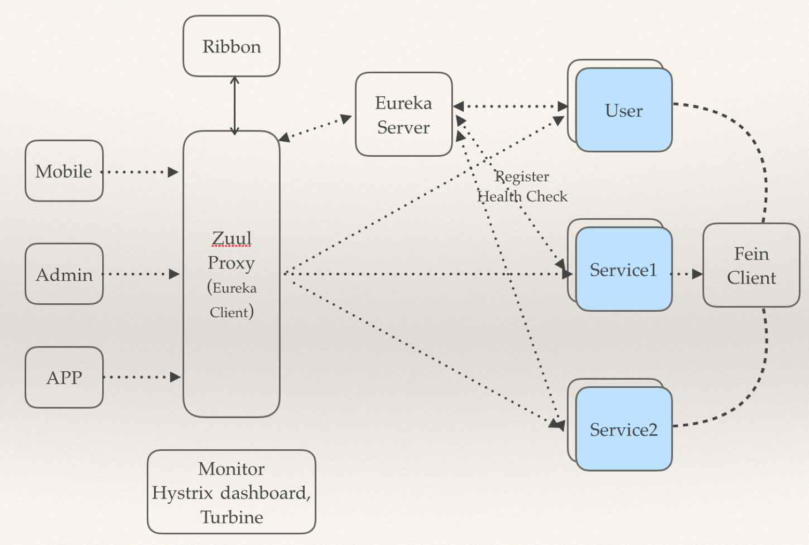

## 简介
Spring cloud是目前最流行的微服务框架。它是在spring boot的基础上构建的，用于快速构建分布式系统的通用模式的工具集。Spring Cloud 包含了许多子项目，提供了一些工具来快速构建分布式系统中一些常用模式，分布式配置管理、服务注册和发现、断路器、智能路由、全局锁等。  
## 同类对比
很多人都会讲spring cloud与dubbo对比，但其实Dubbo只是实现了服务治理，而Spring Cloud的各类组件覆盖了微服务架构的方方面面，服务治理只是其中的一个方面。当然dubbo也有好消息，就是阿里巴巴开始重新维护dubbo了，但以目前来说，spring cloud更全面。以下是对spring cloud与dubbo的全面对比。

| 	功能    |dubbo	|spring Cloud|
|-------|---------|----|
|服务注册中心 |Zookeeper|	Spring Cloud Netflix Eureka|
|服务调用方式 |	RPC	 |REST API|
|服务网关	    |无	|Spring Cloud Netflix Zuul|
|断路器	    |不完善	|Spring Cloud Netflix Hystrix|
|分布式配置   |无	|Spring Cloud Config|
|服务跟踪    |	无	|Spring Cloud Sleuth|
|消息总线	   |无	|Spring Cloud Bus|
|数据流	   |无	|Spring Cloud Stream|
|批量任务     |	无	|Spring Cloud Task|
|……	|……	|……|

## 组件
Spring cloud的最常用的组件如下图所示.图中eureka作为服务注册与发现,共有三个微服务User、Service1和Service2是注册到eureka中的,feign作为内部客户端调用service.zuul作为API网关与eureka相关联，对外部提供服务.Ribbon作为外部客户端调用zuul，再由zuul转发至对应的服务中。monitor和hystrix dashboard作为微服务监控，turbine作为交易链路监控。

### eureka
eureka作为spring cloud的注册与发现，与zookeeper对比，主要有以下几点优势：  
1.eureka天生就是做服务发现与注册，而zookeeper需要依赖dubbo或者自己做工具才可以。  
2.eureka具有客户端缓存，及时服务宕机，客户端依然可以根据客户端缓存互相通信。  
3.在Eureka平台中，如果某台服务器宕机，Eureka不会有类似于ZooKeeper的选举leader的过程；客户端请求会自动切换到新的Eureka节点；当宕机的服务器重新恢复后，Eureka会再次将其纳入到服务器集群管理之中；而对于它来说，所有要做的无非是同步一些新的服务注册信息而已。  

### config 
spring cloud中可以使用config server作为配置中心。与目前[disconf](https://github.com/knightliao/disconf)主要有以下几点区别：  
1.disconf提供了友好的图形界面，而spring cloud没有。  
2.disconf搭建部署非常麻烦。  
3.disconf需要依赖zookeeper，而spring cloud需要依赖git及svn。  
4.disconf本身可以达到无重启自动刷新，而spring cloud需要依赖spring cloud bus+消息队列在刷新。

### ribbon
ribbon的主要是对原先spring的restTemplate的封装，在此基础上做了功能的增强。最大的特点就是引入了客户端负载均衡的形式，避免了引入其他的服务器负载均衡。

### feign
Feign是一种声明式、模板化的HTTP客户端。一般对于内部服务，我们都是用feign来作为服务调用。feign对于开发人员最重要的就是开发简单，开发人员可以在无感知的情况下，进行http请求。

### hystrix
Hystrix是spring cloud的一种防御机制，防止一个服务出现问题造成其他服务阻塞，避免整个系统都面临着瘫痪的风险。同时，hystrix也提供了dashboard来查看服务的监控信息。

### turbine
Turbine是一个监控聚合，将hystrix的监控数据以一个整体的方式展示出来。

### sleuth
Sleuth是spring cloud的分布式跟踪组件，它可以查看各个微服务之间的调用状态。可以配合zipkin来查看所有的信息。

### zuul
zuul是一个API网关，主要是像外部服务提供入口。它可以集成服务聚合和访问权限。

## 案例
这里有我一个spring cloud的项目[案例](https://github.com/maojiawei/zhabei-spring-cloud)里面有对spring cloud各个组件更为详细的介绍，欢迎大家查看并给予意见。

